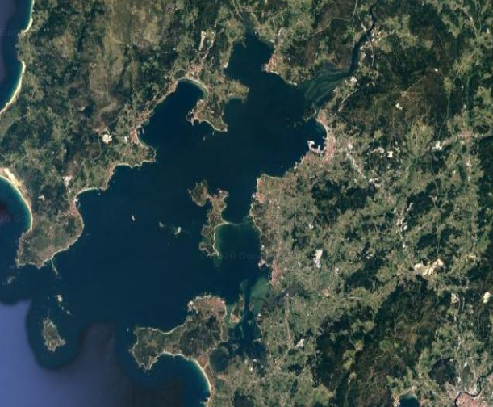

Configuración del modelo
########################

Se va a realizar el modelo con la herramienta CROCO, Coastal and Regional Ocean COmmunity model[1]. CROCO es un sistema de modelización del oceano. La versión
del software que se utilizará en el estudio será la versión 1.1.

Los primeros pasos para la realización del trabajo experimental será la parametrización de la zona de estudio.

Zona de estudio
***************

Por su interés económico y debido a la aparición de mareas rojas la zona de estudio seleccionada para el trabajo será la Ria de Arousa.

Localización
Coordenadas: 
42º 34' 14.4" N - 8º 53' 12.4" W



**Fig. 1 Imagen Satélite de la Ría de Arousa**

La Ría de Arousa es la mayor de las rías de Galicia. Forma parte de las Rías Bajas y está situada entre la Ría de Muros y la de Noia al norte y
la Ría de Pontevedra al sur.

Es la ría de mayor extensión de Galicia, aunque no es la que alcanza mayores cotas batimétricas con sus 69 metros de profundidad máxima en la bocana.

Su configuración física permite una elevada producción de fitoplancton, con un flujo marino característico, que hace que esta ría sea famosa por su riqueza marina, siendo la zona de mayor producción de mejillón de todo el mundo. [`1`_]

Según la descripción proporcionada por la Descripción General de la Demarcación Hidrográfica, la Ría de Arousa se encuentra dividida por las zonas de 
explotación 4 y 5, la cuenca del Río Umia en el margen izquierda y la cuenca del Río Ulla en el derecho. 

El Río Umia divide las cuencas de margen de la Ría en dos zonas: Norte y Sur. En la zona norte se concentra la mayor parte de la población y de la actividad económica. 

El río Ulla es el principal transmisor de recursos hidráulicos y constituye la cuenca de mayor superficie de Galicia Costa con una superficie de 2803 Km2[`2`_]. 

Modelización de la zona de estudio
==================================

Los parámetros para la zona de estudio en CROCO serán:

``cppdefs.h``::

    /* Configuration Name */
        # define RIA_AROUSA_HR

``param.h``::

    #  elif defined  RIA_AROUSA_HR
        parameter (LLm0=179,   MMm0=241,  N=32)   ! RIA_AROUSA_HR

`LLm0` es el número de puntos en la dirección X
`MMm0` es el número de puntos en la dirección y
`N` es el número de niveles de profundidad

``crocotools_param.m``::

    CROCO_title  = 'Ria de Arousa Model';
    CROCO_config = 'RIA_AROUSA_HR';
    %	%
    % Grid dimensions:	% Grid dimensions:
    %	%
    lonmax = -40;   % Maximum longitude [degree east]
    latmax = 55;   % Maximum latitude  [degree north]
    lonmin = -70;   % Minimum longitude [degree east]
    latmin = 25;   % Minimum latitude  [degree north]
    %	%
    % Grid resolution [degree]	% Grid resolution [degree]
    %	%

Para la batimetría de la Ría de Arousa se han descargado los datos de la base de datos de EMODNet. Los datos han sido recortados con QGIS 

`gdal_translate -projwin -9.210812319250916 42.75870563101125 -8.591626925992497 42.10948512539328 -of GTiff NETCDF:"/home/michogarcia/croco-ocean/croco_tools/EMODNet/F3_2018.dtm":DEPTH /tmp/processing_oxs7us/4816b12287d2433b945baf17efce3843/OUTPUT.tif`

QGIS ha generado el netcdf usando `Band1` como nombre de la variable. Con `ncrename` modificamos el nombre de esa variable a `topo` que es el que necesita
croco para generar la batimetría.

`ncrename -v Band1,topo arousa.nc arousa_topo.nc`

Deberemos configurar CROCO para que utilice los datos de batimetría que hemos creado. Para ello modificamos el script `crocotools_param.m` en la línea 196

```
% topofile = [DATADIR,'Topo/etopo2.nc'];
topofile = [DATADIR,'EMODNet/arousa_topo.nc'];
```

.. warning::
    La estructura de directorios que aparece en la documentación da errores con las rutas relativas. A tener en cuenta que hay que modificar en los archivos
    `start.m` y en `jobcomp` estas rutas.

Generación de las condiciones climáticas
****************************************

Resultados
**********


Conclusiones
************

.. _1: https://es.wikipedia.org/wiki/R%C3%ADa_de_Arosa
.. _2: https://circabc.europa.eu/webdav/CircaBC/env/wfd/Library/framework_directive/implementation_documents_1/information_consultation/spain/rbd-galicia/c-drbmp-es-rbd-galicia-p/Cap%2002_Descripcion%20General%20Demarcacion.pdf